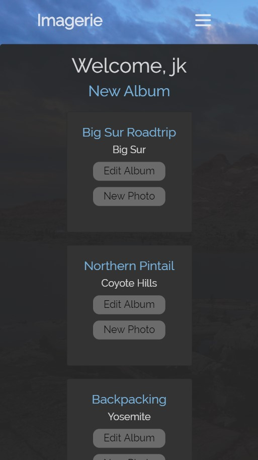

# Project 1: Full Stack Website

## Imagerie, an image collection app
imagery + menagerie

## Technologies Used
- Frontend: Bootstrap CSS, HTML
- Backend: Mongoose, Express, Node.js
- Dependencies: bcyptjs, body-parser, ejs, express, method-override, cloudinary, connect-multiparty, mongoose

## User Stories

## Wireframes

## Data Models
1. Users
2. Albums
3. Photos

