# Project 1: Full Stack Website

## Imagerie, an image collection app
A menagerie is a varied collection of items. On Imagerie, our full-stack website, a user can sign up to create, edit and view their collections of images.

The photo view page:
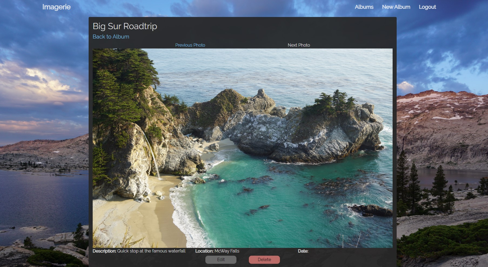

Imagerie is responsive to mobile screen sizes: 

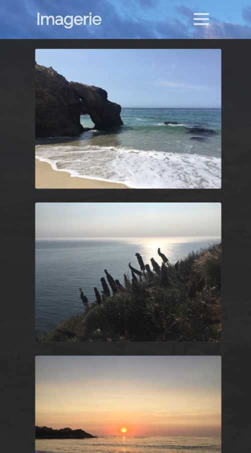

## Scope
### MVP

## Technologies Used
- Frontend: Bootstrap, CSS, HTML, JavaScript
- Backend: Mongoose, Express, Node.js
- Dependencies: bcyptjs, body-parser, cloudinary, connect-multiparty,connect-mongo, ejs, express, express-session, method-override,  mongoose

## User Stories
- User creates an account
- User logs in
- User logs out
- User creates an album
- User creates a photo and adds to album
- User edits an album
- User deletes an album
- User edits a photo
- User deletes a photo

## Wireframes
During our planning, we used figma to create wireframes for each page.
1. Home Page & Sign Up
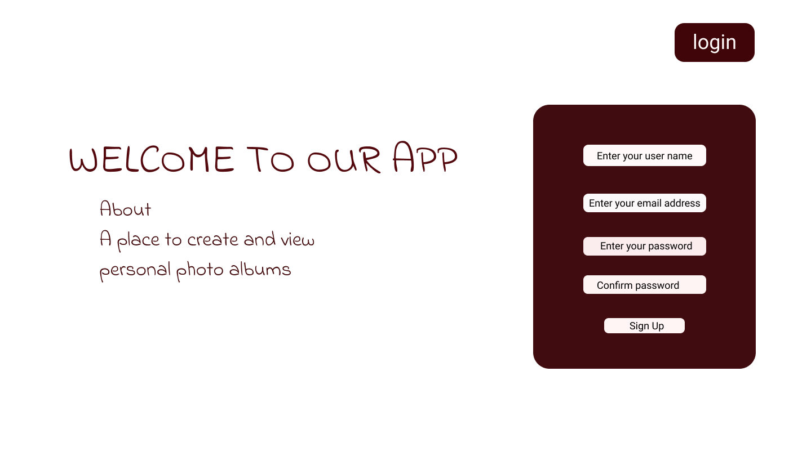
2. Log In
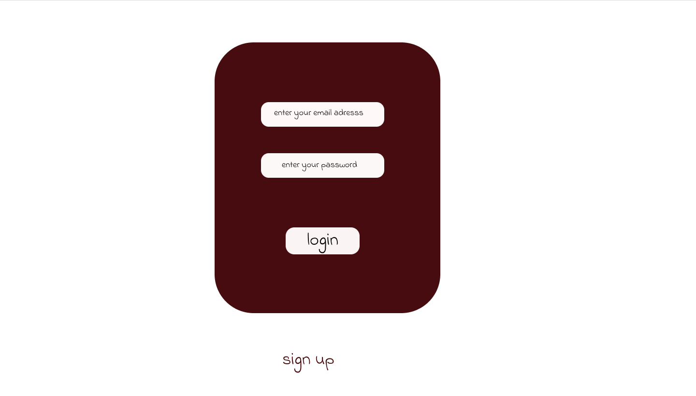
3. Profile Page & Album Index
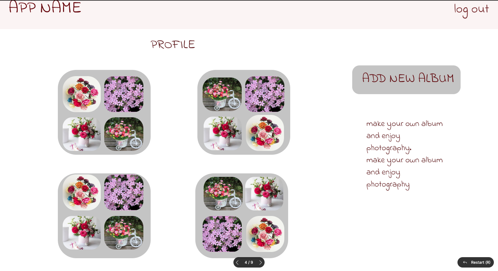
4. New Album
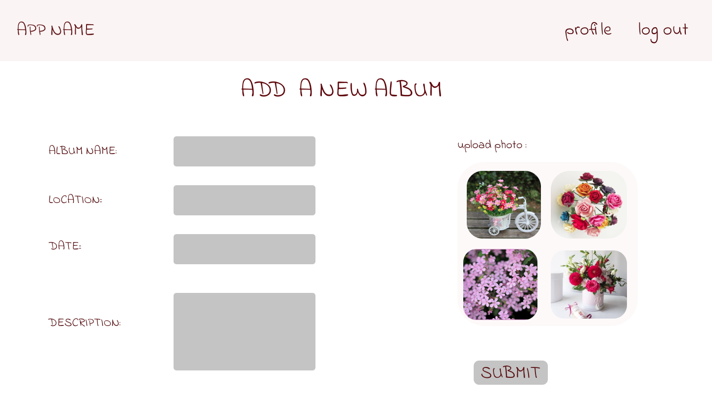
5. View Album
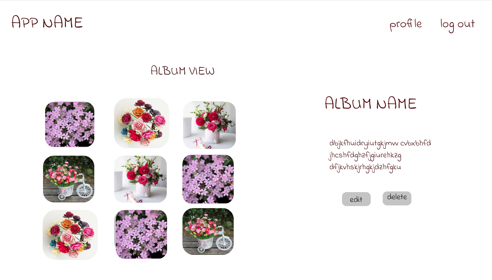
6. Edit Album
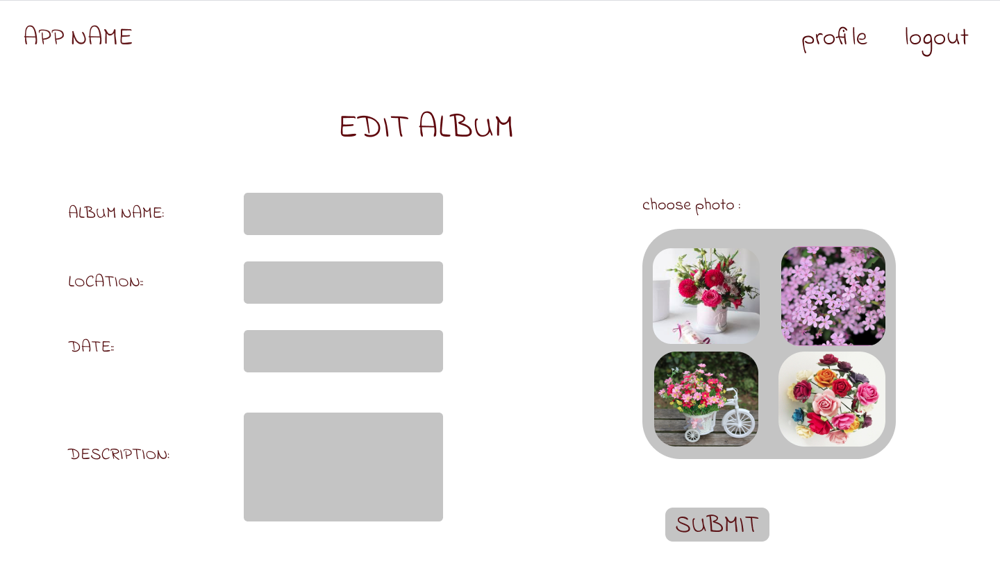
7. New Photo
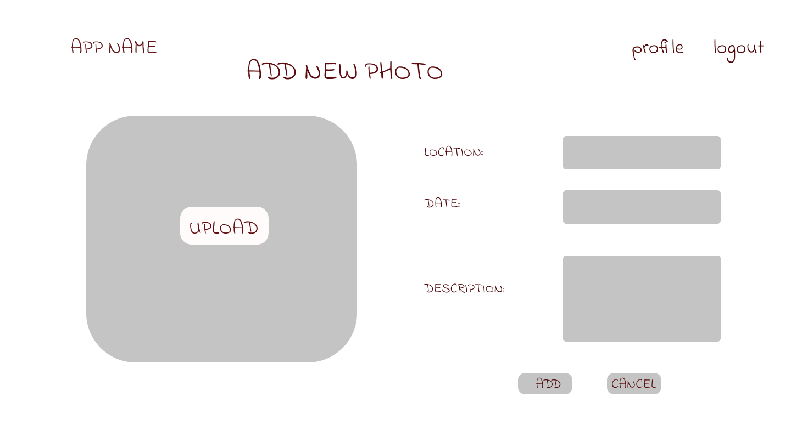
8. View Photo
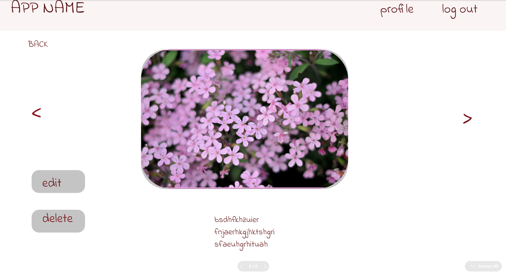
8. Edit Photo
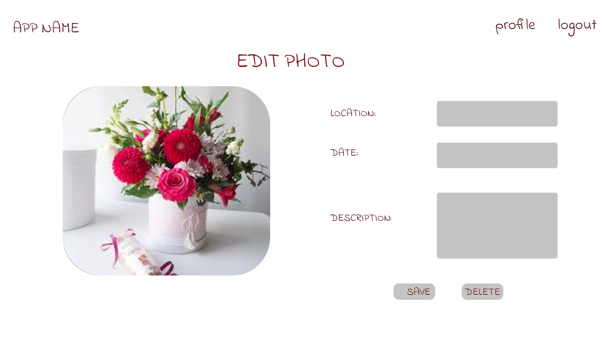

## Data Models
Imagerie uses 3 models
1. Users
2. Albums
3. Photos

